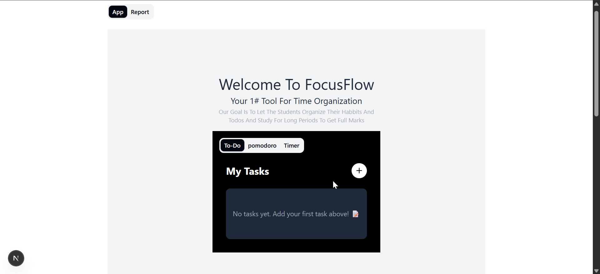
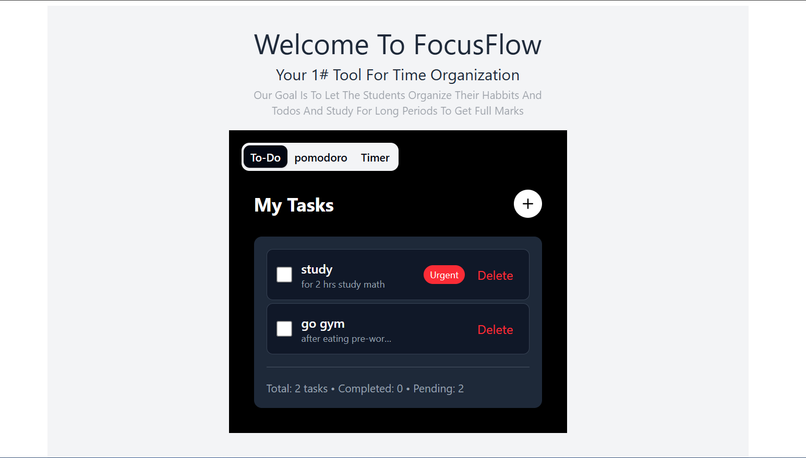
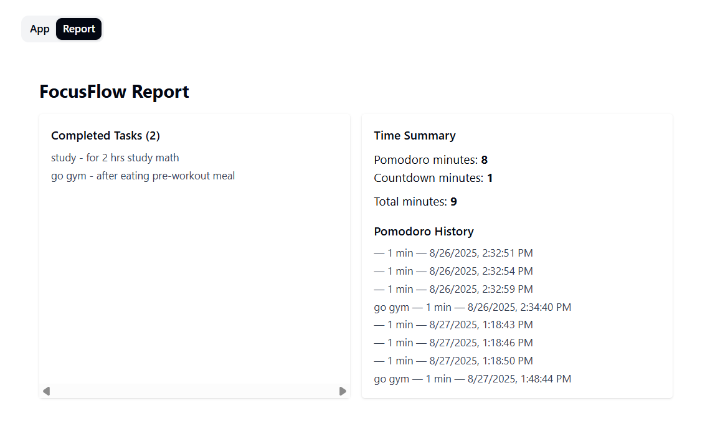
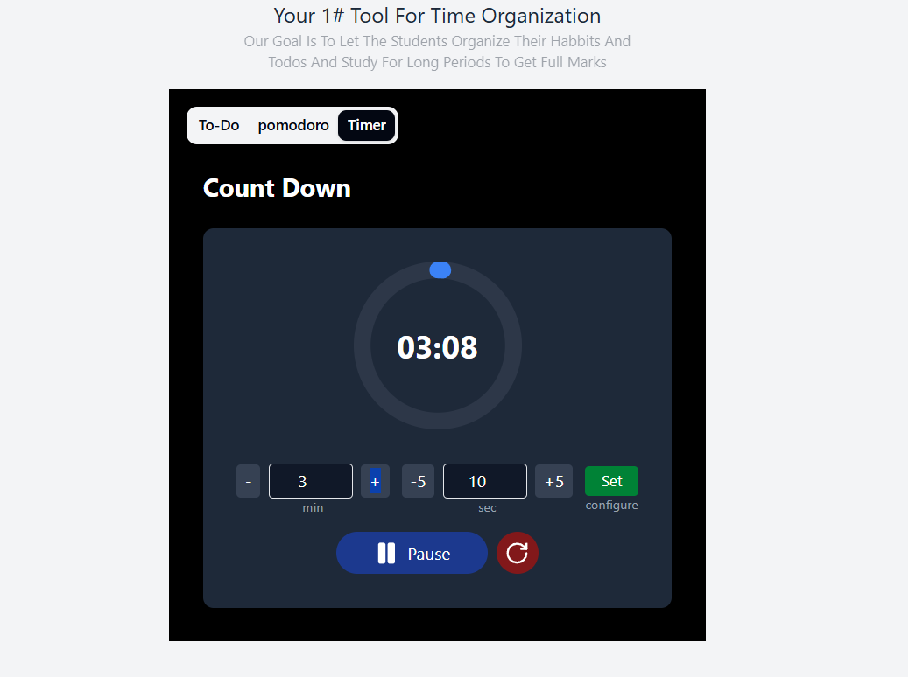

# ⏱️ FocusFlow – Time Management App  
[](https://nextjs.org/)  
[](https://www.typescriptlang.org/)  
[](https://tailwindcss.com/)  
[](https://zustand-demo.pmnd.rs/)  
[](LICENSE)  

FocusFlow is a modern **time management web app** designed to boost productivity using the **Pomodoro Technique** and task tracking.  
It helps students, professionals, and teams stay focused with a clean interface, customizable timers, and progress tracking.  

---

## 🎬 Preview  

### GIF Demo  
  

### Screenshots  
| To-Do List  | Pomodoro Timer | count down | Reports |
|-----------|----------------|------------|---------|
|  |  |  |  |

---

## ✨ Features
- 🔥 **Pomodoro Timer** – Work & break sessions with countdown.  
- ✅ **Task Management** – Add, edit, and track to-dos.  
- 📊 **Reports & Analytics** – View productivity stats.  
- 📱 **Responsive Design** – Works on desktop & mobile.  
- ⚡ **State Management** with **Zustand** (lightweight & persistent).  
- 🎨 **Modern UI** powered by **Tailwind CSS + Shadcn/UI**.  
- 🚀 Built with **Next.js + TypeScript** for scalability.  

---

## 🛠️ Tech Stack
- **Framework**: [Next.js](https://nextjs.org/) (App Router)  
- **Language**: TypeScript  
- **Styling**: Tailwind CSS v4 + Shadcn/UI  
- **State Management**: Zustand  
- **Icons & Assets**: Lucide & SVGs  
- **Build Tools**: PostCSS, ESLint, Vercel-ready  

---

## 📂 Project Structure
```
FocusFlow-TimeManagement/
├── app/                 # Main Next.js app (pages, layouts, global styles)
│   ├── Dashboard/       # Dashboard page
│   ├── components/      # App-specific components (Timer, Pomodoro, ToDos...)
│   ├── hooks/           # Custom React hooks
│   ├── stores/          # Zustand stores (task + pomodoro state)
│   └── globals.css      # Global styles
│
├── components/          # Shared UI components (Shadcn/UI setup)
│   └── ui/              # Button, Dialog, Tabs, Popover, etc.
│
├── lib/                 # Utility functions
├── public/              # Static assets (SVGs, icons, screenshots, GIFs)
├── package.json         # Dependencies & scripts
└── README.md            # Project docs
```

---

## 🚀 Getting Started

### 1️⃣ Clone the repository
```bash
git clone https://github.com/abdelrahman1dev/FocusFlow-TimeManagement.git
cd FocusFlow-TimeManagement
```

### 2️⃣ Install dependencies
```bash
npm install
# or
yarn install
```

### 3️⃣ Run development server
```bash
npm run dev
# or
yarn dev
```

Then open **http://localhost:3000** in your browser 🎉  

---

## 📖 Usage
1. Start the **Pomodoro Timer** from the dashboard.  
2. Add tasks in the **To-Do List** to organize your work.  
3. Track progress in the **Reports Tab**.  

---

## 🗺️ Roadmap
- [ ] Add **user authentication** (Supabase/Auth.js).  
- [ ] Sync tasks & reports to cloud.  
- [ ] Export productivity reports (CSV/PDF).  
- [ ] Team collaboration mode.  
- [ ] Mobile app (React Native).  

---

## 🤝 Contributing
Contributions are welcome!  
1. Fork the project  
2. Create a feature branch (`git checkout -b feature/my-feature`)  
3. Commit changes (`git commit -m 'Add new feature'`)  
4. Push to branch (`git push origin feature/my-feature`)  
5. Open a Pull Request 🎉  

---

## 📜 License
This project is licensed under the **MIT License**.  
Feel free to use and modify for personal or commercial projects.  
